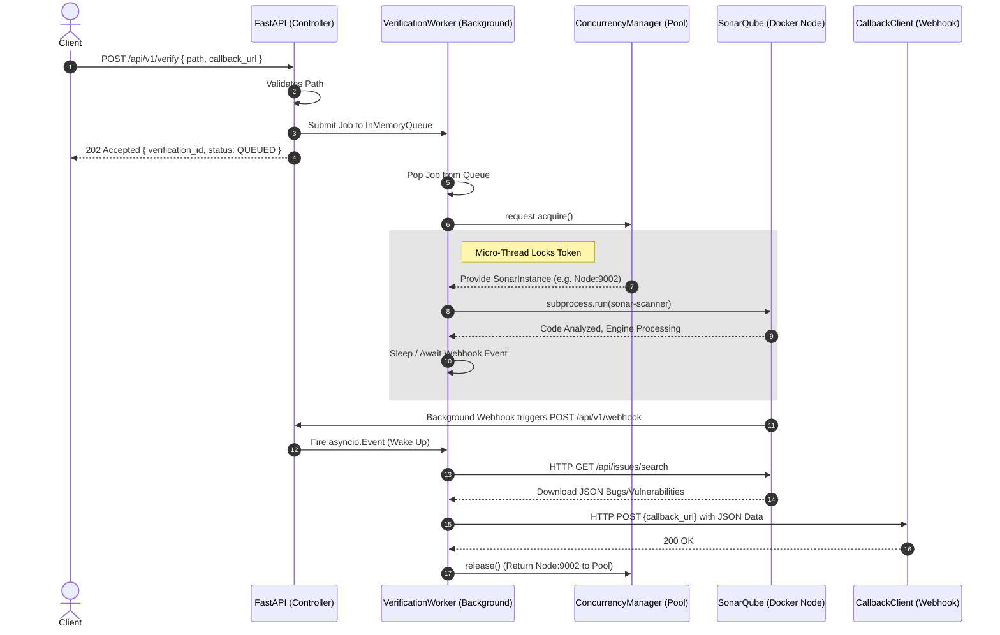

# Verification Service

The Verification Service is a highly concurrent, horizontally scalable FastAPI microservice that orchestrates asynchronous code-quality scans. It interfaces with a load-balanced pool of isolated SonarQube containers, ensuring that multiple LangGraph/AI-generated code snippets can be validated safely and simultaneously.

---

## 1. Sequence Diagram

Below is the architectural workflow detailing exactly how a `POST /verify` request flows through the internal threading model, spawns out to Docker, and loops back via Webhooks.



---

## 2. How to Run

### **Step 1: Install Dependencies**
Ensure you have Python 3.11+ installed.
```bash
pip install -r requirements.txt
```

### **Step 2: Generate the Cluster**
Use the custom script to mathematically construct your cluster size. Note: this will perfectly rewrite your `docker-compose.yml` and explicitly wire your `.env` placeholders!
```bash
python scripts/generate_cluster.py --nodes 2
```

### **Step 3: Boot the Docker Engines**
```bash
docker-compose up -d --remove-orphans
```

### **Step 4: Configure SonarQube (Webhooks & Tokens)**
1. Open your browser to `http://localhost:9001` (and `9002`). Log in with `admin` / `admin`.
2. **Create Webhook**: `Administration > Configuration > Webhooks`
   - Name: `VS_Webhook`
   - URL: `http://host.docker.internal:8000/api/v1/sonarqube/webhook`
   - Secret: `my_webhook_secret`
3. **Generate Token**: `My Account > Security`. Set type to `User Token` and copy it.

### **Step 5: Bind the Architecture**
Open your `.env` file and overwrite the `SONAR_INSTANCES` JSON map with the tokens you just generated to strictly bind the python backend to the containers:
```json
SONAR_INSTANCES={"http://localhost:9001": "squ_tokenYourToken1", "http://localhost:9002": "squ_tokenYourToken2"}
```

### **Step 6: Launch the FastAPI Service**
```bash
uvicorn app.main:app --reload
```
You can now aggressively drop jobs via Postman to `POST http://localhost:8000/api/v1/verify`!

---

## 3. Code Documentation

The codebase is strictly layered using Domain-Driven Design principles.

### **`app/api/`** (Controllers)
- **`verification_controller.py`**: Intercepts `POST` traffic, parses JSON, and injects it into the global service.
- **`webhook_controller.py`**: Intercepts incoming backend signals from SonarQube explicitly to securely wake up sleeping worker threads.

### **`app/infrastructure/`** (State & Concurrency)
- **`concurrency_manager.py`**: The genius load balancer. It mathematically limits the physical `sonar-scanner` Subprocesses to exactly match the available Docker UI nodes available in `.env`.
- **`job_queue.py`**: The native `asyncio.Queue` pipe. Bridges the gap between the traffic-facing FastAPI logic and the invisible sleeper-bot background processor.
- **`job_store.py`**: Synchronous global dictionary retaining Job Models in memory so `GET /verify/{id}` can view status updates across millions of cycles.

### **`app/services/`** (Orchestration)
- **`verification_worker.py`**: The core loop. Generates asynchronous micro-threads (`asyncio.Task`) to concurrently blast through multiple target paths simultaneously without blocking user web traffic.
- **`scan_executor.py`**: Governs the strict timeline of a specific micro-thread (Start, Await Webhook, Download Results, Send Callback).
- **`result_builder.py`**: Re-maps ugly internal SonarQube REST JSON metrics into gorgeous, cleanly-delineated python models.
  
### **`app/integrations/`** (External Boundaries)
- **`sonar_scanner_client.py`**: Handles extremely dangerous `.bat` Subprocess execution securely wrapping the commands in `asyncio.to_thread` bypassing event loop restrictions. Also injects dynamic `-Dsonar.java.binaries=.` bypass flags.
- **`sonar_result_fetcher.py`**: Rapidly crawls down into SonarQube's internal backend via HTTPX to retrieve specific line numbers, types, and text strings associated with code bugs.

### **`scripts/`** (Automation)
- **`generate_cluster.py`**: Fully constructs an N-Node horizontal scaling infrastructure. Natively rewrites `docker-compose.yml` and dynamically injects the `SONAR_INSTANCES` dictionary directly into `.env`.
